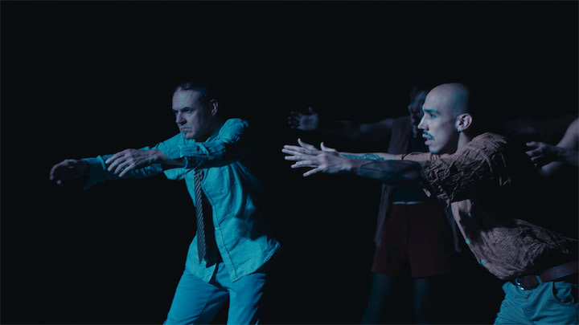
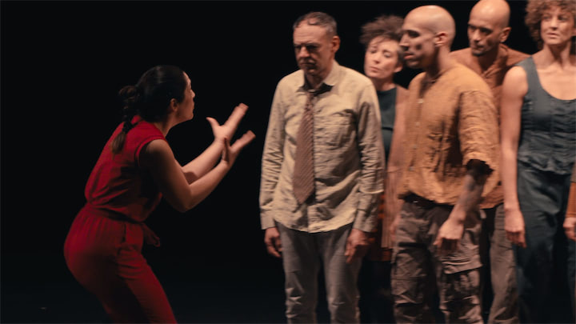
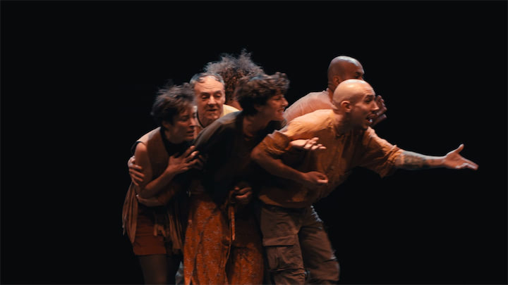
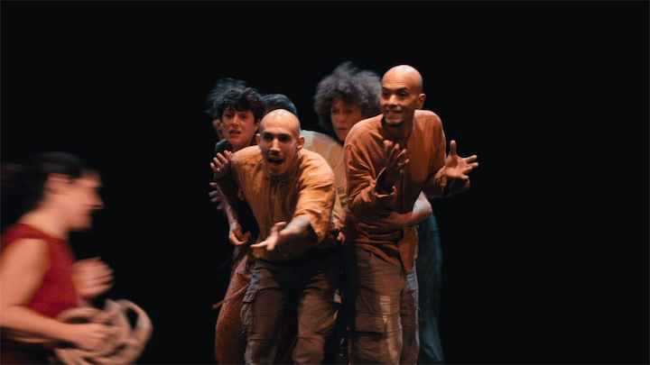
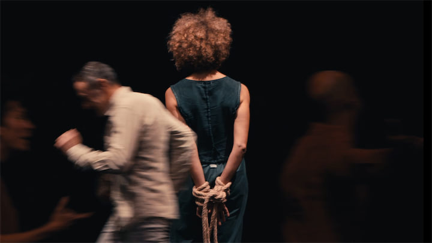

Une production du Colletif Libertalia en collaboration avec la Compagnie Arca Azzurra (IT).

Cléone est une sorcière intemporelle et contemporaine. Esclave en fuite, elle questionne poétiquement le désordre du monde. Vite rejointe par quelques compagnons d’évasion, dans leur course folle, il se font « miroir de nos vies traquées » tout en refusant le rôle de victimes.

