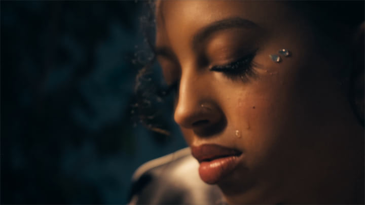
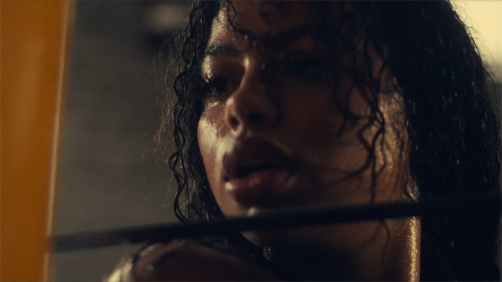
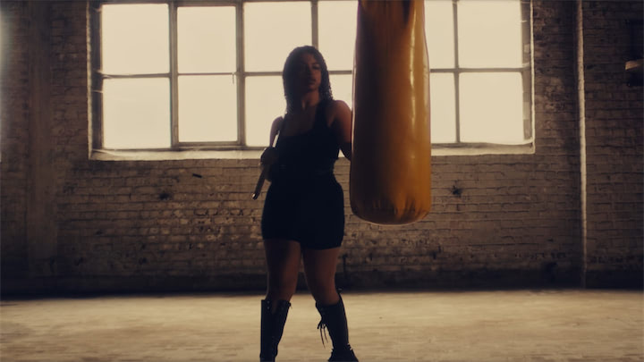
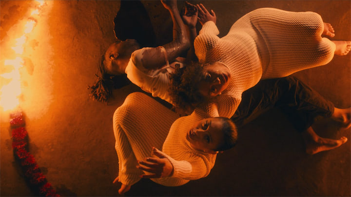

Entre amour et haine, Cœur met en scène Jade et Naïa, deux chanteuses unies et déchirées par le même homme. Dans un univers à la fois intime et intense, leurs voix deviennent les reflets d’un cœur partagé, où passion et trahison se mêlent.

