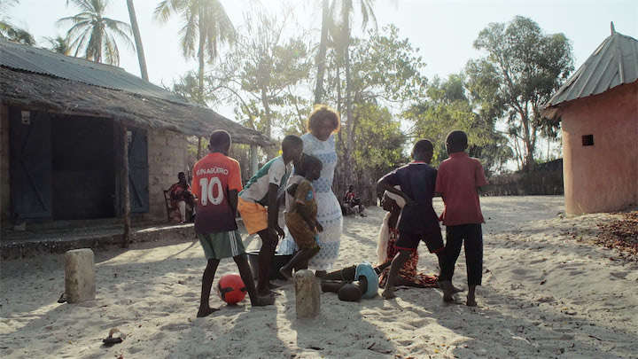

À la périphérie de Ziguinchor, dans le sud du Sénégal… Une jeune femme est accusée de sorcellerie alors que son village est mystérieusement frappé par la maladie. La colère gronde dans le quartier et la jeune femme se retrouve piégée : son sort repose désormais entre les mains de ses deux frères aînés, qui devront déterminer si elle est coupable ou non.

