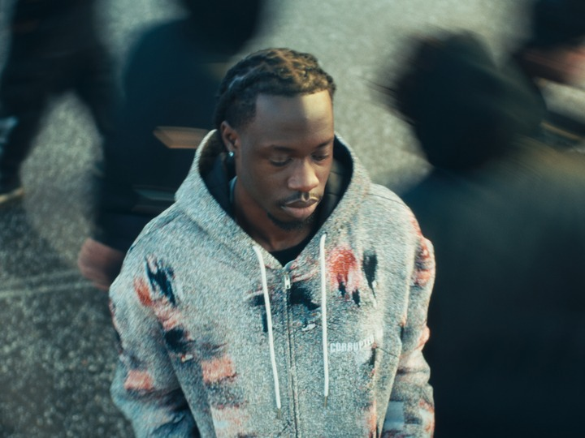
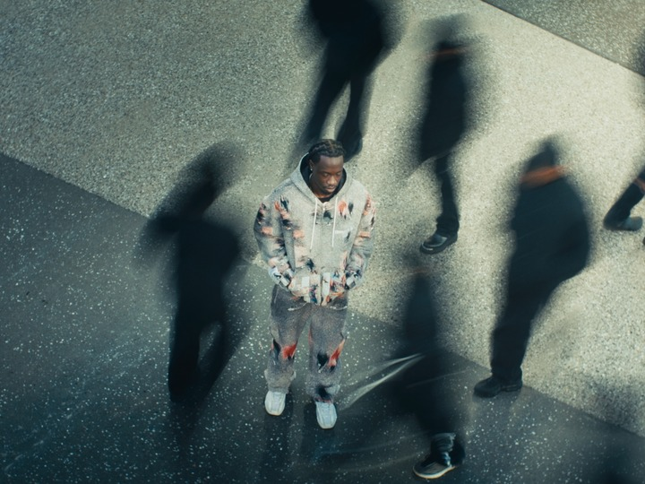
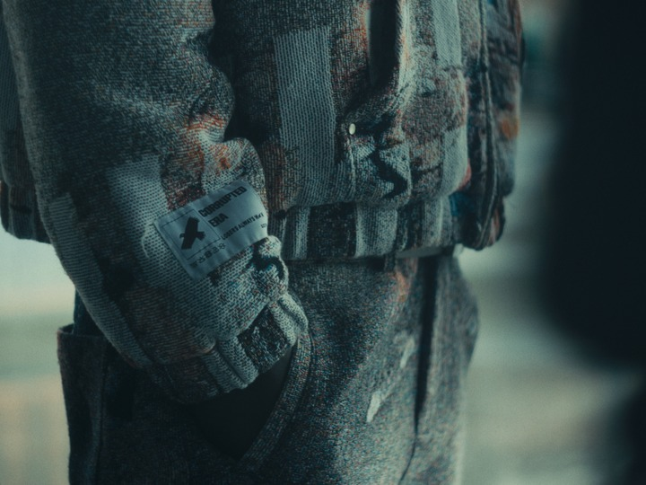
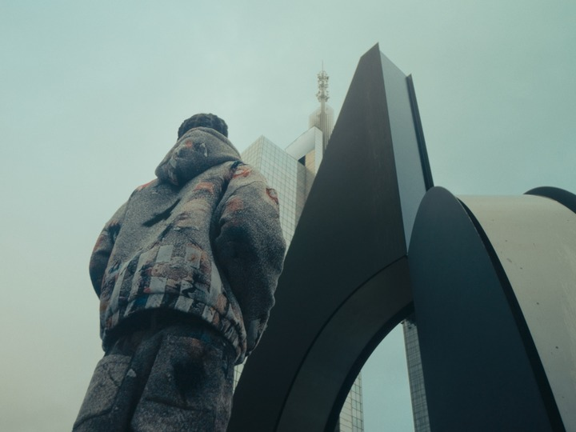
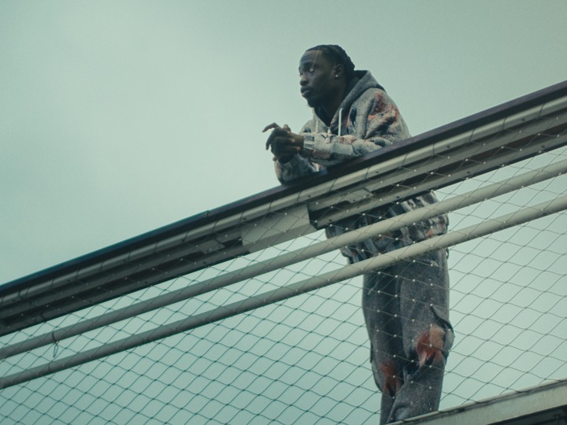
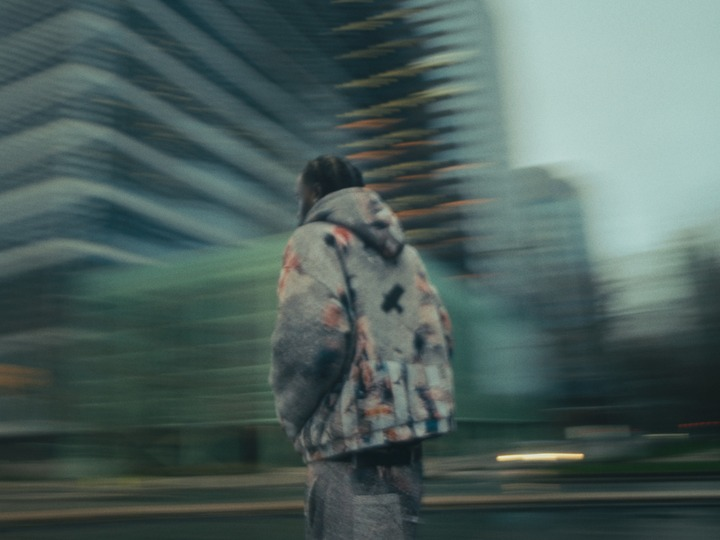
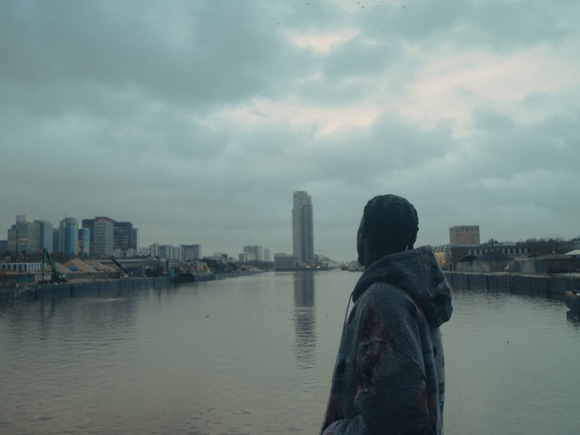

Dans les rues de Bruxelles, Godson part en quête de sens, porté par l'énergie brute de la ville. À travers des silhouettes fortes et des pièces aux coupes affirmées, il incarne l’esprit de Corrupted Era et sa devise : "Losers Always Win.". Entre streetwear audacieux et identité urbaine, cette exploration visuelle tisse un dialogue entre mode, musique et ville. Chaque look devient une trajectoire en marge, où l’échec se transforme en force, et le style en manifeste.

À travers ce visuel, Corrupted Era dévoile sa collection hiver "Parallel Pathways", au cœur de Bruxelles. La marque met en scène le rappeur Godson, révélé dans la saison 3 de Nouvelle École, pour incarner cette collection.

