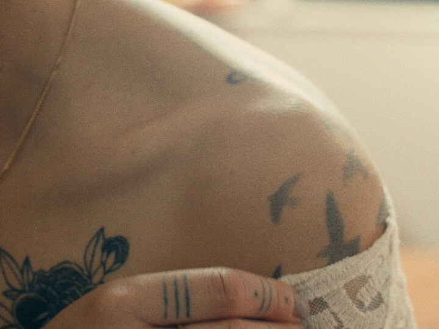

Sous le soleil d’été, un peintre amoureux se laisse enivrer par ses rêveries…

Un clip réalisé de Bref on m’appelle Paulette et Plein Soleil.

Enregistré, mixé et masterisé au Swimming House Studio.

