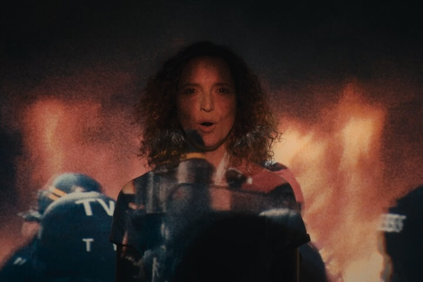
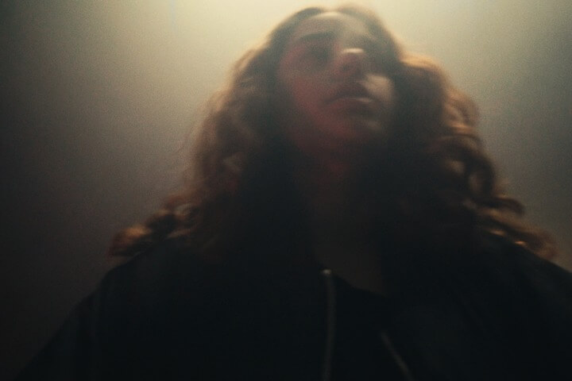
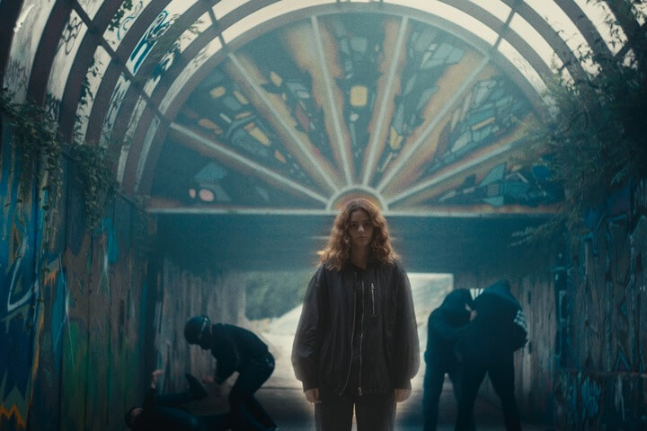
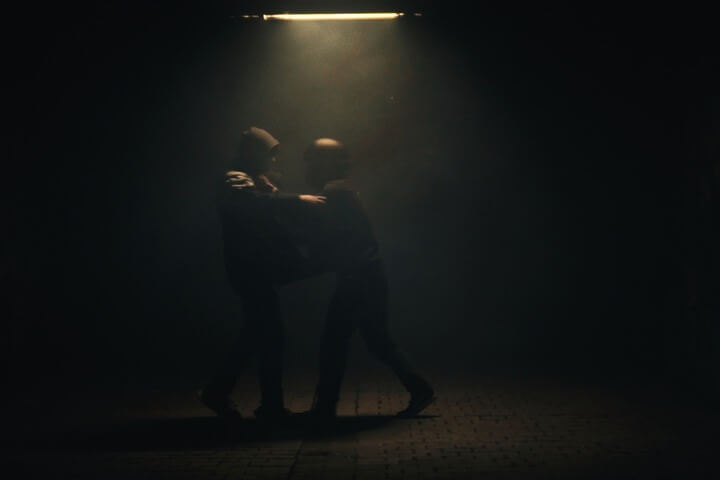
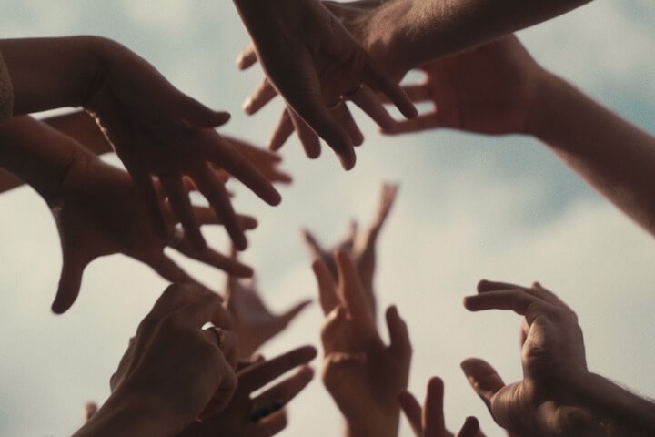

Resistencia est un hymne vibrant à la résistance, un pont entre les générations. À travers un langage poétique et puissant, le clip affirme que la lumière, portée par les voix d’aujourd’hui et d’hier, triomphera toujours de la haine.

Ce clip a été réalisé en 72 heure dans le cadre du VKRS Festival.

