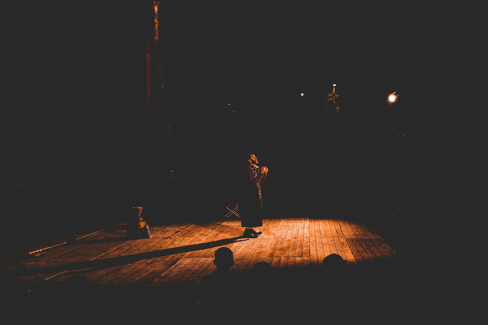
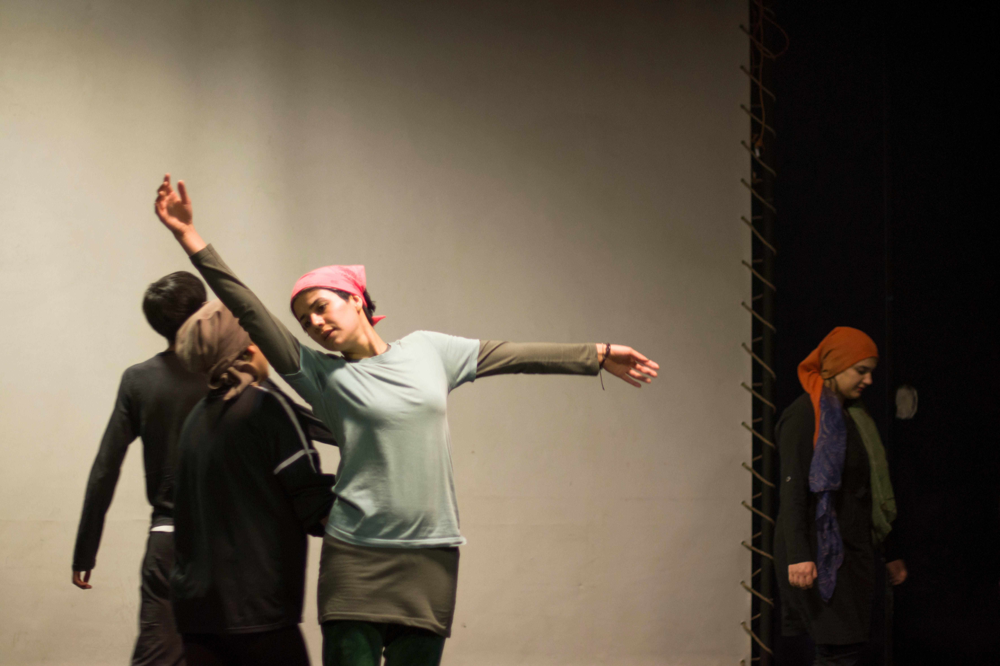

Sur la régie, les techniciens scrutent leurs écrans avec attention, réglant les niveaux sonores, ajustant les angles des caméras, anticipant chaque mouvement pour ne rien rater de l'action qui se déroule sur scène.

La captation d'une pièce de théâtre est un ballet d'activités orchestré par une équipe technique dévouée. Entre les câbles qui s'entremêlent comme des serpents nerveux et les lumières qui dansent en harmonie avec les acteurs, chaque membre de cette équipe est une pièce essentielle d'un puzzle complexe.

Dans les coulisses, c'est un tourbillon d'activité. Les techniciens s'affairent à régler les derniers détails techniques, à vérifier que chaque câble est bien connecté, que chaque lumière est positionnée avec précision. Le régisseur, tel un chef d'orchestre, donne ses dernières instructions, veillant à ce que tout soit prêt pour le lever de rideau.

Pendant ce temps, les caméras sont positionnées stratégiquement, captant chaque geste, chaque expression des acteurs avec une précision presque chirurgicale. Les micros sont ajustés pour capter le moindre murmure, la moindre intonation, afin que chaque mot résonne avec clarté et émotion.